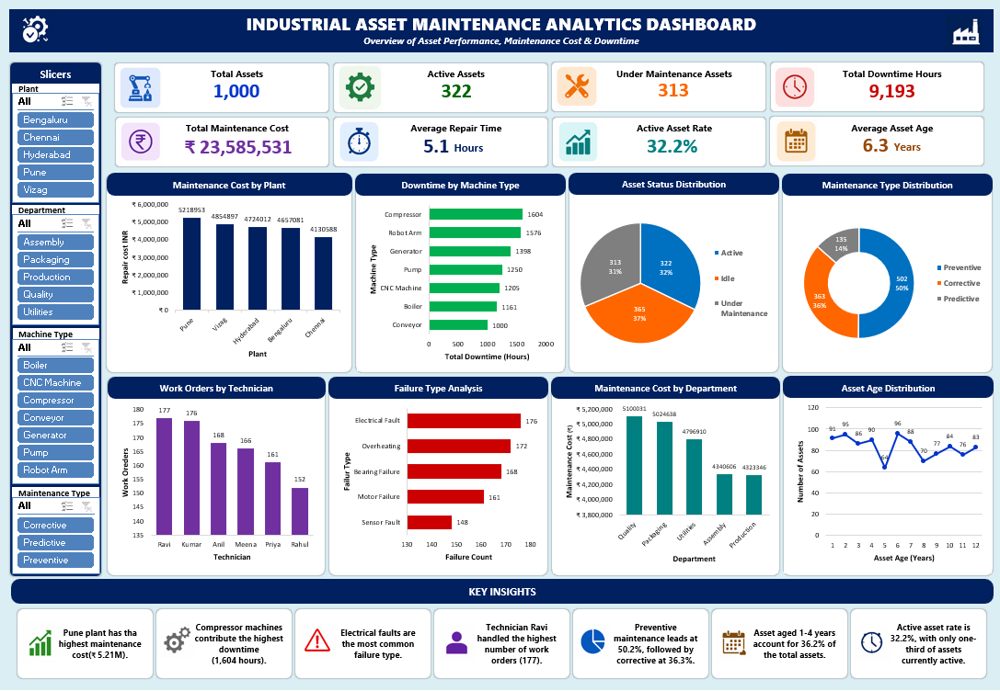

# 📊 Excel Analysis

## Industrial Asset Maintenance Analytics

This folder contains the Microsoft Excel analysis performed on the Industrial Asset Maintenance dataset.

The analysis focuses on asset performance, maintenance costs, machine downtime, failure patterns, technician workload, maintenance types, and asset age.

---

## 📁 Files

| File | Description |
|------|-------------|
| `Industrial_Asset_Maintenance.xlsx` | Complete Excel analysis workbook |

---

## 🛠️ Excel Analysis Performed

The dataset was analyzed using Excel features including:

- Data validation
- KPI calculations
- Pivot Tables
- Pivot Charts
- Aggregation and comparison
- Dashboard development
- Business performance analysis

---

## 📌 Key Performance Indicators

| KPI | Value |
|-----|------:|
| Total Assets | 1,000 |
| Active Assets | 322 |
| Under Maintenance Assets | 313 |
| Total Downtime | 9,193 Hours |
| Total Maintenance Cost | ₹23,585,531 |
| Average Repair Time | 5.1 Hours |
| Active Asset Rate | 32.2% |
| Average Asset Age | 6.3 Years |

---

## 📊 Pivot Table Analysis

The Excel workbook includes analysis of:

### Maintenance Cost
- Maintenance cost by plant
- Maintenance cost by department

### Asset Performance
- Asset status distribution
- Asset age distribution
- Active asset analysis

### Maintenance Operations
- Maintenance type distribution
- Work orders by technician
- Failure type analysis

### Downtime
- Downtime by machine type
- Machine-level operational performance

---

## 📈 Excel Dashboard

The dashboard provides a consolidated view of industrial asset maintenance performance.

It includes:

- Total Assets
- Active Assets
- Under Maintenance Assets
- Total Downtime Hours
- Total Maintenance Cost
- Average Repair Time
- Active Asset Rate
- Average Asset Age
- Maintenance Cost by Plant
- Downtime by Machine Type
- Asset Status Distribution
- Maintenance Type Distribution
- Work Orders by Technician
- Failure Type Analysis
- Maintenance Cost by Department
- Asset Age Distribution

### Dashboard Preview



---

## 💡 Key Findings

### 1. Highest Maintenance Cost

The **Pune plant** recorded the highest maintenance cost at approximately **₹5.21M**.

### 2. Highest Downtime Machine

**Compressor machines** contributed the highest downtime at approximately **1,604 hours**.

### 3. Most Frequent Failure

**Electrical Fault** was the most frequently recorded failure type.

### 4. Technician Workload

**Ravi** handled the highest number of work orders with **177 work orders**.

### 5. Maintenance Type

**Preventive Maintenance** represented the largest maintenance category with approximately **50.2%** of maintenance activities.

### 6. Asset Age

Assets aged between **1 and 4 years** represented a significant portion of the total asset base.

### 7. Asset Availability

The current **Active Asset Rate is 32.2%**, indicating that only around one-third of the assets are currently classified as active.

---

## 🎯 Business Questions Answered

The Excel analysis helps answer the following business questions:

- Which plant has the highest maintenance cost?
- Which machine type has the highest downtime?
- Which failure occurs most frequently?
- Which technician handles the highest number of work orders?
- What type of maintenance is performed most frequently?
- How are assets distributed by status?
- What is the age distribution of the assets?
- Which departments contribute the highest maintenance costs?

---

## 🔍 Business Value

The analysis can help maintenance and operations teams:

- Identify high-cost plants
- Prioritize high-downtime machines
- Monitor technician workload
- Improve preventive maintenance planning
- Identify recurring failure types
- Understand asset lifecycle patterns
- Improve asset utilization
- Support maintenance budgeting decisions

---

## 🧰 Tools Used

- Microsoft Excel
- Pivot Tables
- Pivot Charts
- Excel Dashboard
- Data Analysis
- KPI Analysis

---

## 📂 Project Workflow

```text
Raw Dataset
     ↓
Data Validation
     ↓
Excel Analysis
     ↓
Pivot Tables
     ↓
Pivot Charts
     ↓
KPI Calculation
     ↓
Excel Dashboard
     ↓
Business Insights
```

---

## 📌 Project Context

This analysis is part of the **Industrial Asset Maintenance Analytics** portfolio project.

The overall project integrates:

- Excel
- SQL
- Python
- Power BI

to analyze industrial asset performance and support data-driven maintenance decisions.
